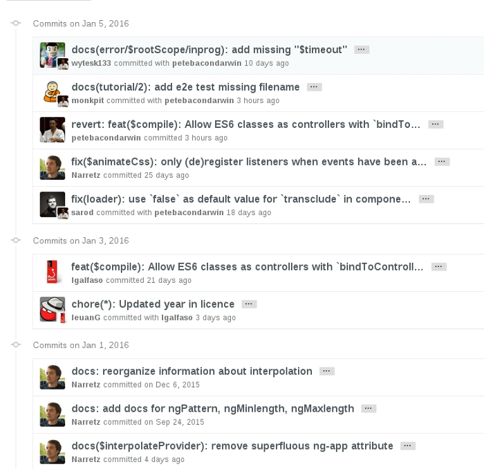

# Commit message 编写规范

##	Commit message 的作用

	在团队开发中，commit message(提交说明)就如同代码注释一样重要，良好的commit message能让团队中的其他成员对你的提交一目了然

	1. 提供更多的历史提交信息(每次提交的目的、涉及的代码范围及作用)，方便快速浏览、方便日常的查询和帮助其他成员更好的帮你Code Review
	2. 可以过滤某些commit(比如文档改动)，便于快速查找信息
	3. 必要时还能方便的生成Change log

## Commit message 示例


上图是著名的前端项目Angular的commit message截图

## AngularJs规范(AngularJS Git Commit Message Conventions)

```
每次提交，Commit message 都包括三个部分：Header，Body 和 Footer。
<type>(<scope>): <subject>
// 空一行
<body>
// 空一行
<footer>

其中，Header 是必需的，Body 和 Footer 可以省略。
不管是哪一个部分，任何一行都不得超过72个字符（或100个字符）。这是为了避免自动换行影响美观。

• Message Header格式： <type>(<scope>): <subject>
    Header 部分只有一行，分三个字段：type（必需）、scope（可选）和subject（必需）
  ○ type : 必填 用于说明commit的类型。总共7个标识：
	   feat: 新增feature
		fix: 修复bug
		docs: 仅仅修改了文档，比README, CHANGELOG, CONTRIBUTE等等
		style: 仅仅修改了空格、格式缩进、变量名等等，不改变代码逻辑
		refactor: 代码重构，没有加新功能或者修复bug
		perf: 优化相关，比如提升性能、体验
		test: 测试用例，包括单元测试、集成测试等
		chore: 改变构建流程、或者增加依赖库、工具等
		revert: 回滚到上一个版本
 ○ 	scope: 可选 scope 用于说明 commit 影响的范围，比如数据层、控制层、视图层或者目录甚至文件等等，视项目不同百不同
 ○ 	subject: 必填 subject是 commit 目的的简短描述，不超过50个字符。
	  约定好commit message的语言，对我们来说最好使用中文
	  最好以动词开头（如使用英文请使用第一人称现在时，并且第一个字母小写）
	  <scope>之后的冒号后面留一个英文输入法的空格
	  结尾不加句号或其他标点符号
	  若此次commit是解决某个issue应该在行末尾注明并加链接，如：...(#101)
• Message Body 部分是对本次 commit 的详细描述，可以分成多行
    ○ 示例
	   More detailed explanatory text, if necessary.  Wrap it to about 72 characters or so.
	   Further paragraphs come after blank lines.
	   - Bullet points are okay, too
	   - Use a hanging indent
	○ 有两个注意点
		§ just as in <subject> use imperative, present tense: “change” not “changed” nor “changes”
		§ includes motivation for the change and contrasts with previous behavior(应该说明代码变动的动机，以及与以前行为的对比)
• Message Footer 该部分只用于两种情况
	○ 不兼容变动
		如果当前代码与上一个版本不兼容，则 Footer 部分以BREAKING CHANGE开头，后面是对变动的描述、以及变动理由和迁移方法。

BREAKING CHANGE: isolate scope bindings definition has changed.
		To migrate the code follow the example below:
		Before:
		scope: {
      myAttr: 'attribute',
    }
		After:
		scope: {
      myAttr: '@',
    }
		The removed `inject` was not generaly useful for directives so there should be no code using it.

	○ 关闭 issue
		如果当前 commit 针对某个issue，那么可以在 Footer 部分关闭这个 issue。Closes #234
		也可以一次关闭多个 issue。Closes #123, #245, #992
• revert
	还有一种特殊情况，如果当前 commit 用于撤销以前的 commit，则必须以revert:开头，后面跟着被撤销 Commit 的 Header。
	revert: feat(pencil): add 'graphiteWidth' option
	This reverts commit 667ecc1654a317a13331b17617d973392f415f02.

	Body部分的格式是固定的，必须写成This reverts commit hash>.，其中的hash是被撤销 commit 的 SHA 标识符。

如果当前 commit 与被撤销的 commit，在同一个发布（release）里面，那么它们都不会出现在 Change log 里面。如果两者在不同的发布，那么当前 commit，会出现在 Change log 的Reverts小标题下面。
```
