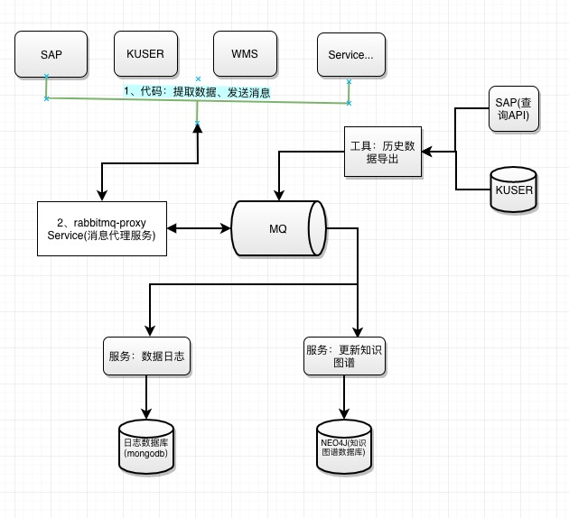
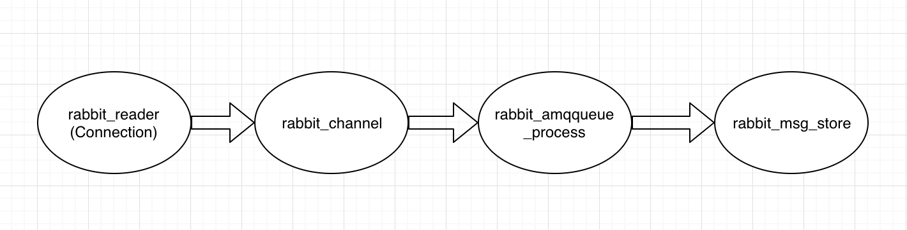
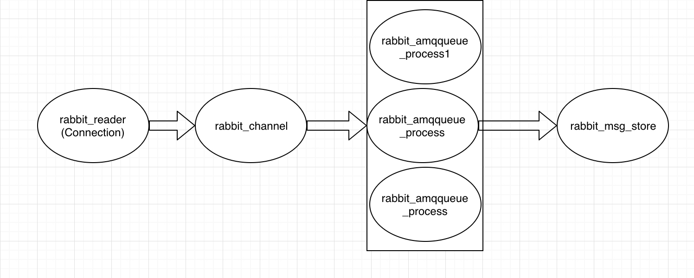

# RabbitMQ 消息中间件
## RabbitMQ 在系统中的整体架构位置


## RabbitMQ消息机制

选择RabbitMQ的发布订阅模式，选择Exchange的Topic模式。


Routing Key为一个句点号“.”分隔的字符串（我们将被句点号". "分隔开的每一段独立的字符串称为一个单词）如"stock.usd.nyse"、"nyse.vmw"、"quick.orange.rabbit"。

Binding Key与Routing Key一样也是句点号“. ”分隔的字符串。

Binding Key中可以存在两种特殊字符"*"与"#"，用于做模糊匹配，其中"*"用于匹配一个单词，"#"用于匹配多个单词（可以是零个）。

## 消息队列接口协议规范

```
{
  type: string   业务类型
  code: string   业务号，唯一编码
  op: string     业务当前操作
  main: {}    业务详细数据,消息主体
  version: string   数据协议版本
}
```

## 消息队列订阅规则
### 交换器Exchange命名规则
- 正常消息数据交换器 message_topic_exchange
- 异常消息数据交换器 error_message_topic_exchange

### RoutingKey定义规则
- 历史数据：history.ServiceXXX.entity.XXXX业务类型
- 实时数据：realtime.ServiceXXX.entity.XXXX业务类型

### 消息队列Queue
在向一个队列推送消息时，一般会在rabbit_amqqueue_process(队列进程)中产生性能瓶颈，Connection和Channel都会处于flow状态（blocked和unblocked之间来回切换），而队列处于running状态，此时队列处产生性能瓶颈

单一Queue进程


多Queue进程


### 消息队列Queue定义规则
根据业务量及消息消费速度不同，消费者可根据以下两种规则
规则一：XXX源服务_XXX目标服务_queue

```
示例：消息生产服务XXX，接收消息服务YYY

消息对列：XXX_YYY_queue
```

规则二：XXX源服务_XXX目标服务_XXX业务_queue

```
示例：消息生产服务XXX，接收消息服务YYY，业务ZZZ

消息对列: xxx_yyy_zzz_queue
```

### 消息订阅bindingKey规则 `*.服务.entity.*`

```
示例1: 模糊匹配xxx服务
binding Key: *.XXX.entity.*

示例2: 模糊匹配xxx服务zzz业务
binding Key: *.XXX.entity.zzz

示例3: 完全匹配xxxx服务zzzz业务的实时消息
binding Key: realtime.XXX.entity.zzzz
```
